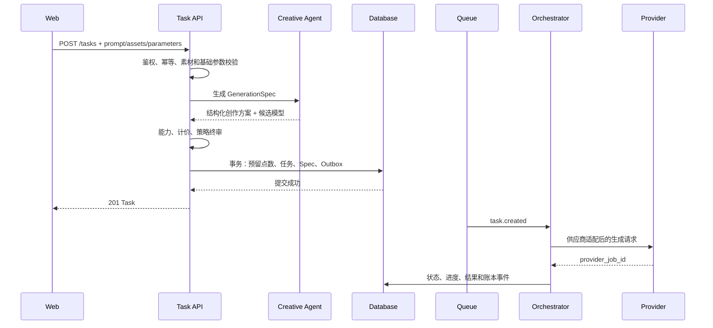

# 视频生成 Agent 编排后端设计

> 文档版本：V1.0  
> 文档状态：后端技术评审稿  
> 更新日期：2026-08-08  
> 目标读者：后端、算法、架构、测试、运维  
> 关联文档：`PRD_V2.0_BACKEND_READY.md`、`openapi/openapi.json`

## 1. 结论与架构决策

视频生成后端不应把用户原始提示词和素材未经处理直接透传给某个供应商，也不应让大模型 Agent 直接控制钱包、任务状态或供应商密钥。

推荐采用“确定性业务内核 + 智能创作 Agent + 供应商适配器”的三层结构：

1. **确定性业务内核**负责鉴权、参数终审、点数、幂等、任务状态、密钥、队列与结果权限。
2. **创作 Agent**负责理解意图、分析素材、编译提示词、推荐模型与参数、生成创作方案和质量报告。
3. **供应商适配器**把统一 `GenerationSpec` 转换为 Seedance、Vidu 等供应商请求，并归一化状态与错误。

第一版无需建设复杂多 Agent。建议先实现单个“创作规划 Agent”，以结构化 JSON 输出为核心；任务执行仍由确定性 Orchestrator 完成。


## 2. Agent 与业务系统边界

### 2.1 Agent 可以做

- 理解用户创作意图和目标平台。
- 对参考图片或视频生成描述、主体约束和风格特征。
- 将自然语言编译成供应商无关的结构化生成方案。
- 生成正向提示词、负向提示词、镜头和运动建议。
- 根据能力、质量、价格、可用性推荐候选模型。
- 对生成结果做一致性和技术质量评估。
- 输出失败原因解释和下一次生成建议。

### 2.2 Agent 不可以做

- 读取、保存或返回完整供应商 API Key。
- 直接修改用户余额、交易流水或任务账单。
- 跳过后端参数、权限、内容安全和模型能力校验。
- 自主提高用户已确认的最高费用。
- 无限制自动重试或切换到更贵模型。
- 直接写入任务终态、退款或审计结论。
- 把用户素材或提示词发送给未获授权的第三方模型。

### 2.3 最终裁决原则

Agent 输出一律视为“不可信建议”。确定性业务层必须重新校验：

- 输出是否符合 JSON Schema。
- 模型是否属于当前用户已启用连接。
- 参数组合是否在模型能力范围内。
- 素材是否属于当前用户且状态为 `ready`。
- 服务端价格是否在用户确认上限内。
- 内容安全和数据处理策略是否允许执行。

## 3. 推荐的生成链路

### 3.1 轻量生成链路（P0/P1 推荐）

适用于 5～15 秒单镜头视频和图片生成。



Agent 超时或不可用时的默认策略：

- 用户明确手动选择模型且参数完整：允许按“直通编译器”降级，生成基础 `GenerationSpec`。
- 用户选择“智能匹配”：返回可重试错误，不得随机选择供应商。
- Agent 失败不得造成扣点和任务半创建。

### 3.2 创作方案预览链路（可选）

如果产品增加“查看创作方案”，可拆成两步：

1. `POST /creative-plans`：生成方案和费用预估，不扣点。
2. `POST /tasks`：提交 `creative_plan_id` 和 `Idempotency-Key`，完成终审、预留和创建。

方案必须设置短期有效期，例如 30 分钟。提交任务时重新校验 Provider、模型能力、价格和素材状态，不能信任旧预估。

## 4. GenerationSpec 统一生成协议

Agent 不应直接输出某个供应商的最终请求体，而应输出供应商无关的 `GenerationSpec`。

示例：

```json
{
  "schema_version": "1.0",
  "mode": "video",
  "intent": {
    "goal": "高端汽车品牌广告",
    "audience": "社交媒体用户",
    "platform": "douyin"
  },
  "prompt": {
    "original": "一辆汽车在海岸公路行驶，要高级、有速度感",
    "optimized": "银色 SUV 沿海岸公路高速行驶，低机位跟拍，午后自然光，背景呈现克制的运动模糊，高端汽车广告质感",
    "negative": "车辆变形，轮胎错位，Logo 改变，画面闪烁，文字乱码"
  },
  "visual_constraints": {
    "subject_consistency": "high",
    "preserve_logo": true,
    "reference_asset_ids": ["asset_01H..."]
  },
  "camera": {
    "shot_type": "tracking",
    "angle": "low",
    "movement": "smooth_follow",
    "motion_strength": "medium"
  },
  "output": {
    "aspect": "16:9",
    "resolution": "1080P",
    "duration_seconds": 10,
    "sound": true,
    "watermark": null
  },
  "routing": {
    "mode": "auto",
    "preferred_provider_id": null,
    "quality_priority": 0.7,
    "cost_priority": 0.2,
    "speed_priority": 0.1
  },
  "cost_guard": {
    "max_points": 32,
    "allow_paid_retry": false
  }
}
```

强制要求：

- 使用 JSON Schema 或类型模型做严格验证，拒绝未知关键字段。
- `schema_version` 必填，后端支持向后兼容和迁移。
- 保存原始提示词、优化提示词、Spec 和最终供应商请求快照的版本关系。
- 不在 Spec 中保存解密后的密钥、签名 URL、用户内部 ID 或敏感日志字段。
- Agent 生成的模型建议不能替代后端 Provider 所有权和启用状态校验。

## 5. Agent 子能力设计

### 5.1 Material Understanding

输入：用户授权的临时素材访问地址或受控对象读取能力。  
输出：素材描述、主体、场景、构图、运动、风格、可保留特征和风险标签。

约束：

- 优先传递短期签名地址或受控二进制，不传永久公开 URL。
- 输出只保存结构化摘要；原始素材仍在私有对象存储。
- 素材识别服务必须进入供应商数据处理白名单。
- 对人物、Logo、儿童和敏感内容生成额外约束标签。

### 5.2 Prompt Compiler

职责：把用户语言转换成模型更容易理解的描述，但不得改变用户核心意图。

输出建议包括：

- 主体、动作、环境、镜头、光线、色彩和风格。
- 主体与 Logo 一致性约束。
- 负向提示词。
- 用户原始语言和供应商需要的目标语言版本。
- 可解释的优化摘要，例如“补充低机位跟拍和运动强度”。

提示词模板必须版本化，记录 `agent_model`、`prompt_template_version` 和输出哈希，便于复现和回归。

### 5.3 Model Router

模型路由不能只由 LLM 自由判断，应采用“硬约束过滤 + 可解释评分”。

先过滤：

- 当前用户已启用的 Provider 和模型。
- 模式、画幅、清晰度、时长、音频、参考素材等能力兼容性。
- Provider 健康状态、配额和熔断状态。
- 数据区域与内容政策是否匹配。

再评分：

```text
score = quality_weight * quality_score
      + speed_weight * latency_score
      + cost_weight * cost_score
      + reliability_weight * success_rate
```

建议把近期成功率、P95 生成耗时、错误率、单位点数成本作为实时指标。路由结果必须保存候选列表、过滤原因和最终选择原因。

前端模式：

- `auto`：后端路由器选择模型。
- `manual`：用户指定 Provider/模型，后端只做能力与安全终审。

### 5.4 Quality Evaluator

质量评估建议分两层：

1. 确定性检查：文件可读、时长、分辨率、音轨、帧率、黑帧、Range 支持。
2. 语义检查：主体一致性、提示词符合度、明显变形、闪烁、Logo 和文字异常。

质量报告示例：

```json
{
  "technical_pass": true,
  "semantic_score": 0.83,
  "prompt_alignment": 0.88,
  "subject_consistency": 0.81,
  "issues": ["最后 0.5 秒存在轻微闪烁"],
  "recommendation": "accept"
}
```

Quality Evaluator 不得直接扣点或创建新任务，只能输出 `accept`、`retry_recommended` 或 `manual_review`。

## 6. 受控重试与模型回退

自动重试必须由规则引擎控制，而不是由 Agent 自由循环。

建议策略：

| 场景 | 默认处理 |
|---|---|
| 网络错误、429、供应商 5xx | 同供应商指数退避重试，不额外扣用户点数 |
| 请求超时但供应商状态不明 | 先按幂等标识查询，禁止直接重复提交 |
| 参数被供应商拒绝 | 归一化错误；允许 Agent 给出修复建议，不自动付费重提 |
| 内容安全拒绝 | 不换模型规避；返回统一内容政策错误 |
| 质量评分较低 | 生成建议；只有符合重试预算时才允许自动重试 |
| Provider 熔断 | 仅在用户允许自动路由且成本不升高时切换候选模型 |

每个任务至少记录：

- `max_attempts`、`attempt_no` 和每次供应商请求 ID。
- 每次请求使用的 Spec、Adapter 和模板版本。
- 重试原因、是否产生供应商成本、是否向用户计费。
- 用户确认的 `max_points` 和自动重试授权。

默认建议：P1 不开启付费自动重试；平台技术失败可以在内部预算内重试一次。

## 7. 数据模型建议

在现有 `tasks`、`task_events`、`provider_connections`、`provider_models` 基础上增加：

### creative_plans

| 字段 | 说明 |
|---|---|
| id / user_id | 随机 ID、用户归属 |
| original_prompt_ciphertext | 原始提示词，受控访问 |
| generation_spec | 结构化 JSONB |
| schema_version | Spec 版本 |
| agent_model / template_version | Agent 与模板版本 |
| status | draft / confirmed / expired / rejected |
| estimated_cost | 服务端预估点数 |
| expires_at | 方案过期时间 |
| created_at | 创建时间 |

### agent_runs

| 字段 | 说明 |
|---|---|
| id / user_id / task_id | 运行及归属 |
| run_type | material_analysis / planning / evaluation |
| input_hash / output_hash | 追踪与去重，不记录秘密 |
| model / template_version | 模型和模板版本 |
| status | running / succeeded / failed / timed_out |
| tokens_in / tokens_out | 成本指标 |
| latency_ms | 耗时 |
| normalized_error | 脱敏错误 |
| created_at | 时间 |

### task_attempts

| 字段 | 说明 |
|---|---|
| task_id / attempt_no | 唯一组合键 |
| provider_id / model_id | 实际路由结果 |
| provider_job_id | 供应商任务 ID |
| request_snapshot | 已脱敏请求快照 |
| status / error_code | 尝试状态 |
| provider_cost | 平台成本 |
| started_at / finished_at | 时间 |

### quality_reports

保存技术指标、语义评分、问题列表、建议动作和评估模型版本。报告属于内部数据，是否向用户展示由产品策略决定。

## 8. 服务与进程划分

初期推荐模块化单体，Agent 和生成 Worker 独立进程：

```text
API Service
  ├─ Auth / Account
  ├─ Provider Registry
  ├─ Asset Service
  ├─ Task API
  ├─ Wallet / Ledger
  └─ Policy / Pricing

Async Workers
  ├─ Creative Agent Worker
  ├─ Generation Orchestrator Worker
  ├─ Provider Polling / Callback Worker
  ├─ Quality Evaluation Worker
  └─ Reconciliation / Cleanup Worker
```

不建议 P1 就拆成多个独立微服务。先通过模块边界、队列主题、事务 Outbox 和独立 Worker 保持解耦，待调用量和团队规模增加后再拆服务。

## 9. 接口演进建议

当前 `POST /tasks` 可以继续作为主入口，建议补充字段：

```json
{
  "routing_mode": "auto",
  "provider_id": null,
  "model_id": null,
  "creative_plan_id": null,
  "agent_options": {
    "optimize_prompt": true,
    "analyze_reference": true,
    "quality_check": false
  },
  "cost_guard": {
    "max_points": 32,
    "allow_paid_retry": false
  }
}
```

可选新增接口：

- `POST /creative-plans`：生成预览方案。
- `GET /creative-plans/{id}`：读取本人方案。
- `POST /creative-plans/{id}/confirm`：可不单独提供，直接由 `POST /tasks` 引用。
- `GET /tasks/{id}/quality-report`：P2 或运营后台使用。

API 响应不直接返回完整供应商提示词模板、内部路由权重、供应商错误原文和敏感安全标签。

## 10. 状态、超时与幂等

对外任务状态继续保持：`queued / generating / done / failed / cancelled`，避免前端复杂化。

内部可以增加阶段：

```text
validating -> planning -> reserving -> submitting
-> provider_queued -> provider_generating -> evaluating
-> persisting_result -> done
```

要求：

- `POST /tasks` 的幂等范围必须覆盖 Agent 规划和任务事务。
- 相同幂等键和相同请求不得重复运行 Agent 或重复扣点。
- Agent 结果可以按输入哈希短期缓存，但必须包含用户、模板版本和素材版本维度。
- Agent 规划建议超时 8～15 秒；超时策略按手动/智能路由模式分别处理。
- 供应商提交、轮询、回调和质检全部独立幂等。
- 任一 Worker 崩溃后必须能安全重新领取，不产生重复供应商任务。

## 11. 安全与隐私

- Agent 服务不得拥有钱包写权限和 API Key 管理权限。
- 只有 Provider Adapter 受控进程可以按连接 ID 请求解密密钥。
- Agent 日志默认删除提示词原文、完整素材 URL、手机号、Token 和 API Key。
- 素材访问使用短期签名并限制来源、用途和有效期。
- 保存 Agent 输入输出时按用户内容数据分类加密和设置保留期。
- 提示词和素材不得默认用于第三方模型训练。
- 模型调用必须配置供应商白名单、数据区域和内容策略。
- 防止提示词注入影响系统权限：素材文字和用户输入只能作为数据，不能覆盖系统策略。
- Agent 生成的 Endpoint、URL、工具调用参数仍需 SSRF 和白名单校验。

## 12. 可观测性与成本

每次调用贯穿同一个 `request_id / task_id / agent_run_id / attempt_id`。

核心指标：

- Agent 成功率、超时率、P50/P95 延迟。
- Agent Token 和单位任务成本。
- Prompt 优化启用率和用户采用率。
- 自动路由各模型选择率、成功率、P95 耗时和平台成本。
- 质量检查通过率、重试率和误判申诉率。
- 每个任务用户点数、供应商成本和 Agent 成本。
- 降级直通率、路由失败率和人工处理量。

必须为 Agent 设置：

- 单请求 Token 上限。
- 单用户并发和频率限制。
- 超时、熔断和每日预算。
- 模型版本灰度和快速回滚开关。

## 13. 测试重点

### 13.1 Agent 契约测试

- 固定输入必须生成符合 Schema 的输出。
- 非法枚举、缺失字段、额外危险字段被拒绝。
- 提示词注入不能改变权限、成本和安全规则。
- 模板或模型升级使用黄金样本回归。

### 13.2 路由测试

- 不支持参数的模型必须被过滤。
- 停用、无权限、失效和熔断 Provider 不可选。
- 手动模式不得被 Agent 擅自换模型。
- 自动模式的选择原因和评分可追踪。

### 13.3 钱包与重试测试

- Agent 超时或规划失败不得扣点。
- 相同幂等键并发调用只产生一次规划和一次任务。
- 重复队列、重复回调、重复质检不重复扣点或退款。
- 自动重试不能超过用户确认的最大点数。

### 13.4 安全测试

- Agent、日志和质量报告中不存在完整 Key。
- 跨用户不能读取 Spec、素材分析或质量报告。
- 签名素材 URL 过期后失效。
- 恶意素材文字不能触发未授权工具或外部请求。

## 14. 分阶段建设与增量工期

以下工期是相对现有基础后端计划的额外投入，按 1 名熟练后端/AI 工程师配合 Codex 估算。

| 阶段 | 范围 | 增量工期 |
|---|---|---:|
| A：结构化创作方案 | GenerationSpec、Prompt Compiler、Schema 校验、版本与日志 | 3～5 人日 |
| B：素材理解与智能路由 | 视觉分析、能力过滤、路由评分、降级策略 | 4～6 人日 |
| C：结果质检与受控重试 | 技术质检、语义评分、质量报告、重试预算 | 5～8 人日 |
| D：多镜头创作 Agent | 脚本、分镜、角色一致性、拼接、配音字幕 | 10～20 人日 |

推荐当前版本只承诺 A+B：在基础生成后端上额外增加约 **7～11 人日**，两名工程师可并行压缩到约一周半。

## 15. 推荐实施顺序

1. 先完成确定性生成闭环和 Provider Adapter，确保没有 Agent 也能生成。
2. 定义并冻结 `GenerationSpec 1.0` 与严格 Schema。
3. 接入 Prompt Compiler，保存原始输入、优化结果和版本信息。
4. 增加素材理解，但限制为结构化分析，不赋予业务写权限。
5. 实现能力过滤和可解释 Model Router。
6. 通过灰度开关让部分任务使用 Agent，比较成功率、成本和用户采用率。
7. 指标稳定后再增加质量评估和受控重试。
8. 多镜头 Agent 作为独立产品阶段，不纳入当前 P0。

## 16. 后端评审检查表

- [ ] Agent 与钱包、密钥、任务状态的权限边界清晰。
- [ ] GenerationSpec 有严格 Schema、版本和迁移策略。
- [ ] 手动模式和智能模式的降级行为已确定。
- [ ] 路由先做硬约束过滤，再做评分。
- [ ] 用户确认的最大费用贯穿所有尝试。
- [ ] 自动重试有次数、费用、错误类型和熔断限制。
- [ ] Agent 运行、供应商尝试和质量报告可追踪。
- [ ] 提示词、素材、密钥和签名 URL 不进入非必要日志。
- [ ] Agent 不可绕过内容安全、SSRF、权限和参数校验。
- [ ] Agent 不可用时，核心生成链路有明确降级策略。
- [ ] 真实供应商端到端测试覆盖规划、扣点、生成、质检和结果。

