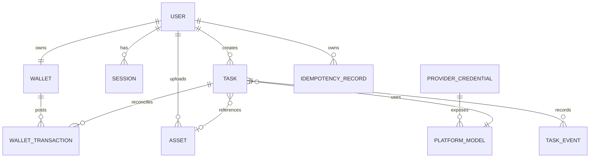
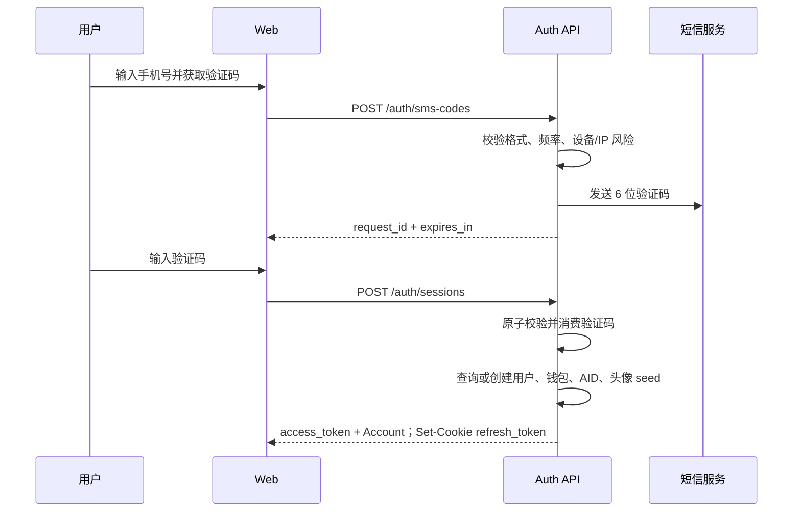
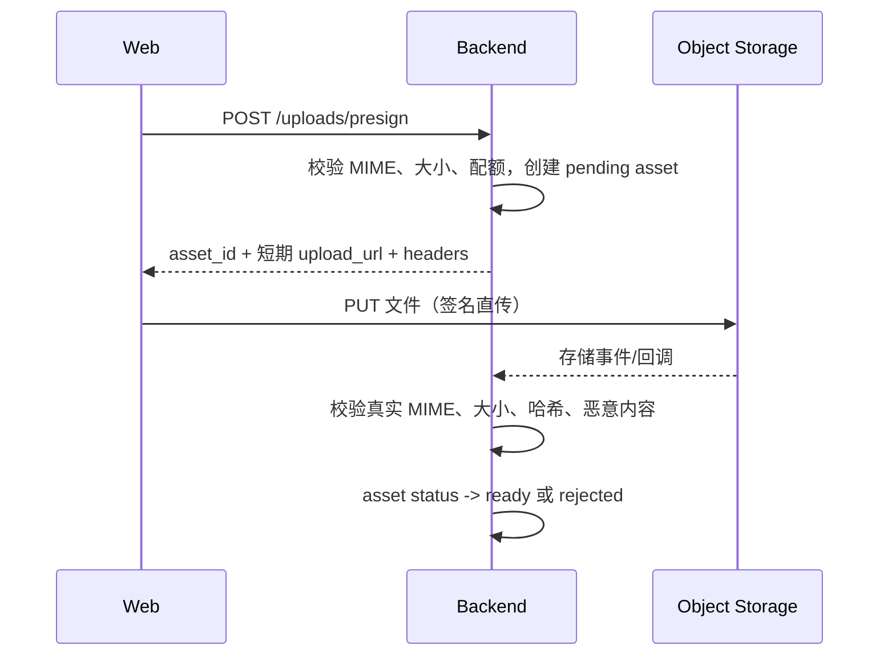
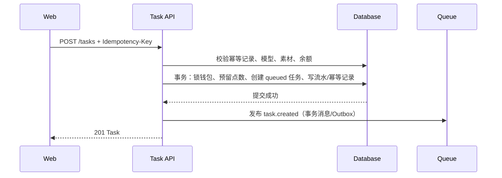
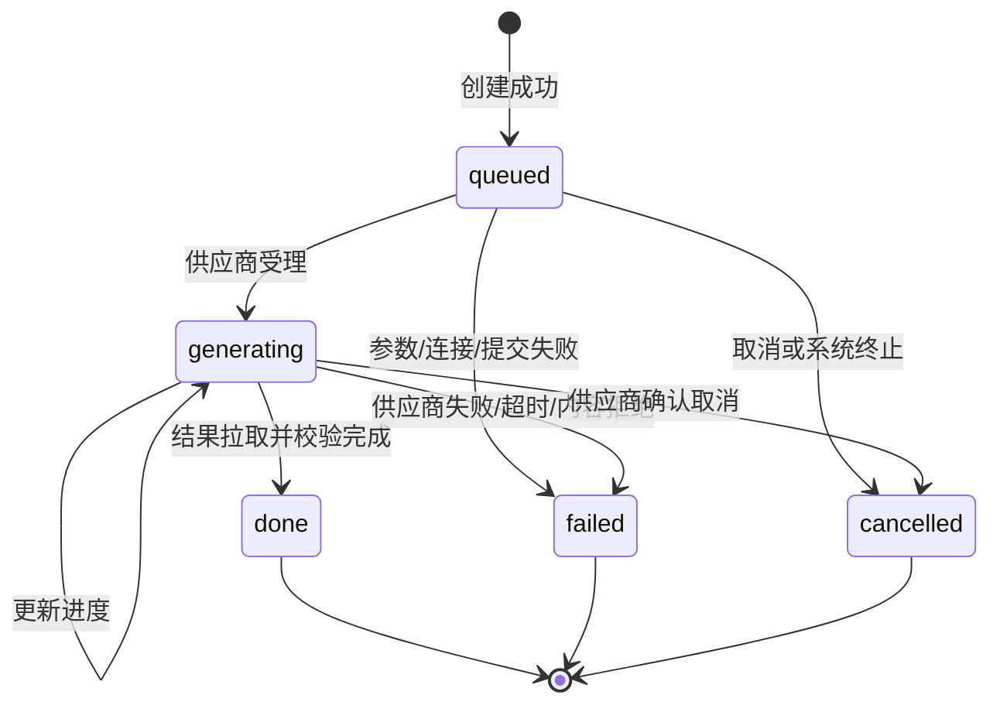

# 策量智算 · AI 内容创作平台 PRD

> 文档版本：V2.1（P0 契约冻结版）
> 文档状态：开发基线  
> 更新日期：2026-08-10
>
> 产品范围：Web 端 AI 视频/图片生成、任务中心、账户、创作点、平台模型目录
> 交互基线：当前 `策量智算_HTML原型_V1.2` 运行结果  
> 接口基线：[`openapi/openapi.json`](../openapi/openapi.json)  
> 联调说明：[`docs/BACKEND_INTEGRATION.md`](./BACKEND_INTEGRATION.md)
> API 快速参考：[`docs/API_REFERENCE.md`](./API_REFERENCE.md)
> 一期模型政策：[`docs/PHASE1_PLATFORM_MODEL_POLICY.md`](./PHASE1_PLATFORM_MODEL_POLICY.md)

## 0. 文档使用规则

本 PRD 是后端开发、前端联调、测试验收的共同业务基线。实现优先级如下：

1. 业务行为、状态迁移、事务和安全规则以本 PRD 为准。
2. HTTP 路径、请求/响应字段和枚举以 OpenAPI 为准。
3. 页面结构、文案和交互反馈以当前 HTML 原型为准。
4. 三者冲突时不得自行猜测：先修订 PRD 与 OpenAPI，再进入开发。

本版已经冻结的关键决策：

- 首页就是创作工作台，仅支持“视频生成”和“图片生成”。
- 一级导航仅保留“首页”和“任务中心”。
- 不建设素材库、团队空间、智能分镜和在线剪辑。
- 第一期仅允许平台运营人员在服务端配置模型供应商 API Key；用户端不提供第三方 Key 的新增、编辑、删除、复制或回显能力。
- 用户中心仅分为“账户、余额”两个子页面，不提供 API Keys 或团队管理。
- AID 是系统生成、不可修改、不可枚举的唯一用户标识。
- 所有长列表均由服务端分页；任务创建、扣点和退款必须可幂等、可追溯。

## 1. 产品定义

### 1.1 产品定位

策量智算是一款轻量 AI 内容创作平台。用户通过手机号验证码登录，在首页组合提示词与参考素材，从平台开放模型目录选择模型和生成参数后提交异步任务；系统负责素材安全上传、平台凭证调用、任务进度同步、结果播放下载和创作点结算。

### 1.2 目标用户

- 内容创作者：快速生成短视频、宣传图和概念样片。
- 品牌/电商运营：制作商品展示、社媒内容和营销素材。
- 市场策划：在方案阶段快速验证视觉方向。
- AI 工具重度用户：从平台开放模型中选择并精确控制输出参数。

### 1.3 产品目标

- 用户在单页内完成输入、配置、提交与进度追踪。
- 后端屏蔽供应商差异，提供统一模型、任务、计费和结果协议。
- 同一业务操作不会因重试产生重复任务或重复扣点。
- 平台 API Key、上传文件、结果文件和账户数据满足生产安全要求。
- 任务、余额、交易记录可以互相对账并定位到请求与供应商调用。

### 1.4 非目标

V2.0 不包含：

- 团队、组织、成员、角色邀请与共享空间。
- 独立素材库、品牌资产库、模板市场。
- 智能分镜、时间线剪辑、字幕编辑、配音编辑。
- 充值支付、发票、退款申请和套餐购买页面。
- 模型训练、LoRA、数字人或工作流编排。
- 用户自定义头像、密码登录和第三方 OAuth 登录。
- 用户自带 Key（BYOK）、用户自定义 Endpoint 和用户级供应商连接。
- 基于 Agent 的自动选模或静默切换模型；第一期模型由用户明确选择。

## 2. 角色、权限与数据边界

V2.0 仅有“登录用户”一个产品角色。所有业务资源均归属于当前会话用户。

| 资源 | 可读 | 可写 | 权限规则 |
|---|---|---|---|
| 账户 | 当前用户 | 无（V2.0 不支持改资料） | 只能通过会话读取 `/me` |
| 钱包/交易 | 当前用户 | 系统写入 | 客户端不可直接改余额或创建流水 |
| 模型目录 | 当前用户 | 无 | 只读平台已开放且可用的模型；不返回凭证或内部连接信息 |
| 上传素材 | 当前用户 | 当前用户 | `asset_id` 与 `user_id` 强绑定 |
| 生成任务 | 当前用户 | 当前用户 | 查询、删除、播放前均校验所有权 |
| 任务结果 | 当前用户 | 无 | 仅对已完成且未删除任务签发短期地址 |

服务端不得信任客户端提交的 `user_id`、AID、余额、点数单价、任务状态、进度或供应商返回结果。用户身份必须从访问令牌解析。

## 3. 信息架构与页面能力

### 3.1 全局顶部导航

- 首页：创作工作台。
- 任务中心：完整任务列表。
- 创作点：展示当前可用余额，点击进入“余额”。
- 头像菜单：用户中心、退出登录。
- 不提供页面级“返回首页”面包屑。

### 3.2 首页

- 文案：“把灵感，变成下一帧。”
- 模式：视频生成、图片生成。
- 输入：提示词、单个参考图片或视频。
- 参数：模型、画幅、清晰度；视频额外包含时长、生成音频、水印文字；图片模式使用生成数量。
- 提交：展示预计点数与预计耗时，创建任务后自动进入轮询。
- 右侧：进行中的任务，与左侧创作卡片上下对齐。
- 下方：推荐案例；点击后只回填提示词/推荐参数，不直接创建任务。

### 3.3 任务中心

- 状态筛选：全部、生成中、排队中、已完成。
- 搜索：按任务标题模糊搜索。
- 列：任务、状态、消耗点数、创建时间、操作。
- 完成任务缩略图提供播放按钮；点击打开播放弹窗。
- 列表由服务端分页，默认每页 20 条；不足一页时不显示分页器。
- 进行中任务允许查看，不允许删除；已完成、失败、取消任务允许删除记录。

### 3.4 用户中心

本地侧边导航固定为：

- 账户：姓名、手机号、头像和 AID；AID、手机号可复制，AID 不可编辑。
- 余额：可用创作点、本月已用、用量进度、交易记录。
- 余额页附带说明：模型服务由平台统一提供与维护，创作点包含模型调用、智能处理与结果存储服务。

不显示账户安全卡、编辑资料、管理套餐、套餐名称、套餐有效期和团队管理。

## 4. 核心领域模型

### 4.1 领域关系



### 4.2 建议数据表

字段类型以 PostgreSQL 为例；若使用其他数据库，必须保留相同约束语义。

#### users

| 字段 | 类型 | 规则 |
|---|---|---|
| id | uuid | 主键，内部使用，不返回前端 |
| aid | varchar(40) | 唯一、不可变、不可顺序枚举，唯一索引 |
| phone_ciphertext | text | 手机号加密存储 |
| phone_hash | char(64) | 规范化手机号 HMAC，用于唯一查询，唯一索引 |
| name | varchar(60) | 首次登录生成默认名称 |
| avatar_seed | integer | 注册时安全随机生成，之后保持稳定 |
| status | varchar(20) | active / disabled |
| created_at / updated_at | timestamptz | UTC 存储 |

AID 推荐格式为 `clzs-` 加 16～24 位随机 Base32 字符；不得包含数据库自增 ID、手机号或注册日期等可推断信息。

#### sessions / refresh_tokens

| 字段 | 类型 | 规则 |
|---|---|---|
| id | uuid | 主键 |
| user_id | uuid | 索引，外键 users.id |
| token_hash | char(64) | 仅保存刷新令牌哈希 |
| expires_at | timestamptz | 过期时间 |
| revoked_at | timestamptz nullable | 退出或风险事件时撤销 |
| user_agent_hash / ip_prefix | varchar | 风险审计，不保存不必要明文 |

#### sms_codes

| 字段 | 类型 | 规则 |
|---|---|---|
| request_id | uuid | 主键，返回前端用于审计 |
| phone_hash | char(64) | 索引 |
| code_hash | char(64) | 验证码哈希，不保存明文 |
| scene | varchar(20) | 当前仅 login |
| expires_at | timestamptz | 默认 5 分钟 |
| attempts | smallint | 最大 5 次 |
| consumed_at | timestamptz nullable | 一次性消费 |

#### provider_credentials（平台内部）

| 字段 | 类型 | 规则 |
|---|---|---|
| id | uuid | 内部主键，不返回用户端 |
| provider_key | varchar(60) | 平台供应商标识，唯一索引 |
| endpoint | varchar(255) | 平台审核并配置的 HTTPS Endpoint |
| api_key_ciphertext | text | KMS/信封加密密文 |
| secret_reference | text | 推荐只保存 Secret Manager 引用 |
| enabled | boolean | 是否允许平台模型调用 |
| health_status | varchar(20) | unknown / valid / invalid |
| last_verified_at | timestamptz nullable | 最近验证时间 |
| created_at / updated_at | timestamptz | UTC |

凭证只允许平台运维后台或受控发布流程写入；用户 API、Web 构建产物和普通业务日志均不得出现完整 Key。

#### platform_models

| 字段 | 类型 | 规则 |
|---|---|---|
| id | uuid | 内部主键 |
| credential_id | uuid | 外键、索引，仅内部可见 |
| model_key | varchar(100) | 实际供应商模型标识 |
| display_name | varchar(100) | 平台内部展示名，对外映射为 OpenAPI `Model.name` |
| mode | varchar(10) | video / image |
| capabilities | jsonb | 支持的画幅、分辨率、时长、音频、水印等 |
| pricing_rule | jsonb | 服务端计价规则 |
| status | varchar(20) | available / maintenance / disabled |
| audience_rule | jsonb | 当前用户是否可见的灰度/权限规则 |

#### assets

| 字段 | 类型 | 规则 |
|---|---|---|
| id | uuid | 前端 `asset_id` |
| user_id | uuid | 所有权索引 |
| object_key | text | 私有存储对象键 |
| file_name | varchar(255) | 清理路径字符 |
| content_type | varchar(50) | MIME 白名单 |
| size_bytes | bigint | 1～524,288,000 |
| sha256 | char(64) nullable | 完成上传后计算 |
| status | varchar(20) | pending / uploaded / ready / rejected / expired |
| expires_at | timestamptz | 未绑定任务素材清理时间 |
| created_at | timestamptz | UTC |

#### tasks

| 字段 | 类型 | 规则 |
|---|---|---|
| id | uuid | 前端 `task_id` |
| user_id | uuid | 分页与鉴权索引 |
| platform_model_id | uuid | 用户选定的平台模型，创建时快照关联 |
| mode | varchar(10) | video / image |
| title | varchar(100) | 从提示词安全截取或服务端生成 |
| prompt_ciphertext | text | 按敏感内容策略加密或受控访问 |
| parameters | jsonb | 画幅、分辨率、时长、音频、水印等提交快照 |
| reference_asset_id | uuid nullable | 当前版本至多一个 |
| status | varchar(20) | queued / generating / done / failed / cancelled |
| progress | smallint | 0～100 |
| estimated_cost | integer | 服务端估算值 |
| billed_cost | integer | 最终扣点，未结算前为 0 |
| provider_job_id | varchar(255) nullable | 供应商任务标识，唯一索引建议带 platform_model_id |
| result_object_key | text nullable | 私有结果对象键 |
| poster_object_key | text nullable | 私有封面对象键 |
| error_code / error_message | varchar/text nullable | 面向产品的归一化错误 |
| deleted_at | timestamptz nullable | 用户删除记录时间 |
| created_at / started_at / finished_at | timestamptz | UTC |

任务分页索引至少包含 `(user_id, deleted_at, created_at desc, id desc)` 和 `(user_id, status, created_at desc, id desc)`。

#### task_events

记录每次状态迁移、供应商请求 ID、进度和归一化错误。事件只追加不修改，用于追踪、客服与对账。

#### wallets / wallet_transactions

| 表 | 关键字段 | 规则 |
|---|---|---|
| wallets | user_id, available, reserved, version | 每用户一行；余额不得为负；乐观锁或行锁 |
| wallet_transactions | id, user_id, task_id, type, amount, balance_after, reference, idempotency_key, occurred_at | 只追加；`amount` 正数入账、负数扣减；幂等键唯一 |

交易类型内部枚举与界面文案映射：

| 内部类型 | UI 文案 | 金额方向 |
|---|---|---|
| task_debit | 任务消耗 | 负数 |
| plan_grant | 套餐发放 | 正数 |
| campaign_reward | 活动奖励 | 正数 |
| failure_refund | 失败退款 | 正数 |
| manual_adjustment | 人工调整 | 正/负 |

#### idempotency_records

唯一约束 `(user_id, operation, idempotency_key)`，保存请求体哈希、资源 ID、HTTP 状态和响应摘要，至少保留 24 小时。

#### audit_logs

记录登录风险、平台凭证变更、模型启停、签发播放地址和人工余额调整。不得记录完整验证码、访问令牌、刷新令牌、API Key、提示词原文或签名 URL 查询参数。

## 5. 核心流程与逻辑

### 5.1 手机号验证码登录



规则：

- 手机号必须匹配中国大陆 11 位格式；服务端先规范化再计算哈希。
- 验证码固定 6 位，有效期 5 分钟，仅可成功使用一次，最多尝试 5 次。
- 同一手机号 60 秒内最多发送 1 次、每小时最多 5 次、每天最多 10 次。
- 同一 IP 每分钟最多 10 次发送请求；超限返回 429 和 `retry_after`。
- 登录成功时，如果用户不存在，必须在同一事务创建用户、AID 和钱包初始记录。
- Access Token 建议 30 分钟有效，只存前端内存；Refresh Token 建议 30 天，使用 `Secure; HttpOnly; SameSite=Lax` Cookie。
- 刷新令牌使用旋转机制；旧令牌再次使用时撤销该会话族。
- `DELETE /auth/session` 撤销刷新令牌、清除 Cookie；访问令牌自然过期或进入短期黑名单。

### 5.2 账户与 AID

- `/me` 返回 `aid`、`name`、当前用户本人的手机号、可选邮箱和 `avatar_seed`。手机号只允许在当前账户接口返回，必须全程 TLS 传输、加密存储且禁止写入日志或埋点。
- AID 创建后永不改变，不支持客户端传入和修改。
- AID 可被复制用于客服、审计和未来公开引用，但任何按 AID 查询的内部接口仍需鉴权和访问控制。
- `avatar_seed` 由后端从批准的图标库种子范围安全随机生成；相同 seed 必须稳定映射到同一头像。
- 停用用户访问任一业务接口均返回 `ACCOUNT_DISABLED`。

### 5.3 平台模型与凭证管理

- 用户端只读 `GET /models`，不提供 `/providers`、Key CRUD、Key 验证、Endpoint 配置或凭证回显接口。
- 平台运营人员通过独立受控后台或部署流程配置供应商 Endpoint、密钥引用、模型能力、价格和开放范围；该后台不属于本期用户产品范围。
- API Key 必须保存于 Secret Manager/KMS，业务数据库优先只保存 `secret_reference`；只有 Provider Adapter Worker 具备按引用读取权限。
- 模型健康检查由平台后台定时执行。模型不可用时把状态改为 `maintenance` 或 `disabled`，新任务返回稳定错误，不得替用户静默切换模型。
- 已创建任务保存模型、能力、价格和适配器版本快照，平台后续修改目录不得改变历史任务语义。

### 5.4 模型能力与参数联动

首页只展示同时满足以下条件的模型：平台已开放给当前用户、`status=available`、模式匹配且能力配置完整。

当前 OpenAPI 以 `GET /models` 返回平台模型目录。后端必须以 `platform_models.capabilities` 做最终校验，不能只依赖前端下拉框。

| 参数 | 视频模式 | 图片模式 | 校验规则 |
|---|---|---|---|
| prompt | 必填 | 必填 | Trim 后 1～1000 字符 |
| model_id | 必填 | 必填 | 必须来自当前用户可见的平台模型目录且模式匹配 |
| aspect | 必填 | 必填 | 16:9 / 9:16 / 1:1 / 4:3，且模型支持 |
| resolution | 必填 | 必填 | 必须属于模型能力集合 |
| duration | 必填 | 不适用 | 5s / 10s / 15s / 30s，且模型支持 |
| count | 不适用 | 必填 | 1 / 2 / 4，且必须属于模型能力集合 |
| sound | 可选 | 忽略/拒绝 | 仅模型支持时允许 true |
| watermark | 可选 | 当前不支持 | 1～20 字符；只有启用水印时提交 |
| reference_asset_id | 可选 | 可选 | 属于当前用户且状态 ready，MIME 与模型兼容 |

当组合不合法时返回 422 `TASK_INVALID_PARAMETERS`，`details.fields` 列出字段、原因和允许值。服务端不得静默替换用户参数。

### 5.5 素材上传



规则：

- 允许 `image/png`、`image/jpeg`、`image/webp`、`video/mp4`、`video/webm`。
- 单文件最大 500 MiB；预签名有效期建议 10 分钟。
- 存储桶必须私有；对象键由服务端生成，不能使用用户文件名作为路径。
- 直传 CORS 仅允许生产前端域名和所需方法/请求头。
- 创建任务前必须确认素材已上传完成并通过实际文件头、大小和安全扫描。
- `pending` 素材 24 小时未完成自动过期；未绑定任务的 `ready` 素材按数据保留策略清理。
- 同一个 `asset_id` 不得跨用户引用；越权统一返回 404，避免泄露资源存在性。

当前 OpenAPI 未定义“查询素材状态”接口。P0 可由对象存储完成事件驱动更新，并在创建任务时同步检查；若上传后处理耗时超过 2 秒，应在 OpenAPI 增加 `GET /assets/{asset_id}`。

### 5.6 点数预估与任务创建

#### 服务端计价

客户端提交的 `max_points` 仅代表用户确认的最高点数，不能作为实际扣点依据。服务端计算权威 `estimated_cost`，并按以下输入计价：

- 模型与供应商计价规则。
- 模式、分辨率、时长或图片数量。
- 是否生成音频、水印及其他增值参数。

服务端计算结果与客户端预估不一致时：

- 差值不超过可配置阈值：以服务端值创建并返回实际 `cost`。
- 超过阈值或服务端值更高：返回 409 `COST_CHANGED`，`details` 包含新预估，前端要求用户确认后使用新的幂等键重提。

#### 创建事务



强制规则：

- `Idempotency-Key` 必填且为 UUID；同用户同操作至少保留 24 小时。
- 相同 Key + 相同请求体：返回首次成功响应，不再创建、不再扣点。
- 相同 Key + 不同请求体：返回 409 `IDEMPOTENCY_CONFLICT`。
- 校验顺序：会话 → 幂等 → 参数 → 平台模型可用性 → 素材 → 服务端计价 → 余额 → 事务写入。
- 钱包加行锁或使用版本号 CAS，保证并发请求不能把余额扣成负数。
- 任务记录、点数预留/扣减、交易流水、幂等记录和 Outbox 必须在同一数据库事务，或采用可证明一致的 Saga。
- 队列发布失败时由 Outbox 重试，不回滚已经成功返回的任务。
- 201 返回的任务初始状态为 `queued`、进度为 0、`cost` 为服务端最终预估/预留点数。

### 5.7 点数扣减、结算与退款

采用“创建时预留、供应商受理后结算、失败时补偿”的规则：

1. 创建任务：`available -= estimated_cost`，`reserved += estimated_cost`；写入内部 `points_reserved` 事件。此时交易记录可暂不对用户展示。
2. 供应商确认受理：`reserved -= estimated_cost`，写入一条 `task_debit` 交易，金额为负数，任务 `billed_cost=estimated_cost`。
3. 供应商在受理前失败：释放预留，`available += estimated_cost`，不产生任务消耗；如前端已经展示扣款，则必须生成 `failure_refund` 对冲。
4. 供应商受理后失败：默认生成等额 `failure_refund`；若供应商确实计费且产品决定不退，必须通过独立配置明确，不能由代码临时判断。
5. 实际费用低于预留：只结算实际费用并释放差额；高于预留不得透支，默认仍按用户确认的预估上限结算，多出部分记平台成本，除非产品引入二次确认流程。
6. 所有余额变化必须产生唯一、不可修改的流水，并保存 `balance_after`。

对账恒等式：

`期末余额 = 期初余额 + 所有已入账交易 amount`；`wallet.reserved = 所有未结算任务的预留金额之和`。

系统每日执行钱包余额、任务 billed_cost、交易流水、供应商账单四方对账，异常进入告警和人工处理队列。

### 5.8 异步任务处理

#### 状态机



状态约束：

| 状态 | progress | 可删除 | 可获取结果 | 点数状态 |
|---|---:|---|---|---|
| queued | 0 | 否 | 否 | 已预留，未最终结算 |
| generating | 1～99 | 否 | 否 | 已结算或按供应商策略预留 |
| done | 100 | 是（软删除记录） | 是 | 已结算 |
| failed | 0～99 | 是 | 否 | 已释放或已退款 |
| cancelled | 0～99 | 是 | 否 | 已释放或已退款 |

- 状态只能按上表迁移；终态不可回到进行态。
- 回调和轮询更新必须幂等，使用供应商事件 ID 或 `(provider_job_id, status, progress)` 去重。
- `progress` 只允许单调递增；供应商无进度时使用阶段映射，不得随机回退。
- Worker 领取任务应使用租约/可见性超时；崩溃后任务可被再次安全领取。
- 供应商提交超时不等于失败：先按幂等请求标识查询供应商是否已创建任务，避免重复提交。
- 默认任务超时：排队 30 分钟、视频生成 60 分钟、图片生成 20 分钟；超时值配置化。
- 供应商错误归一化为：认证失败、余额不足、参数错误、内容拒绝、限流、服务不可用、超时、未知错误。

### 5.9 任务列表、搜索与分页

`GET /tasks` 规则：

- `page` 默认 1，最小 1。
- `page_size` 默认 20，最小 1，最大 100。
- `status` 接受 OpenAPI 的单一状态。页面“生成中”对应 `generating`，“排队中”对应 `queued`，“已完成”对应 `done`；“全部”不传。
- `q` Trim 后最大 100 字符，按任务标题进行不区分大小写的包含搜索；不得直接拼接 SQL。
- 默认稳定排序为 `created_at DESC, id DESC`。
- 返回 `items`、`page`、`page_size`、`total`。超出末页返回空 `items`，不报错。
- 只返回未被当前用户软删除的记录。

`GET /wallet/transactions` 使用相同分页默认值和稳定排序。所有新增长列表必须复用统一分页协议，不允许仅在浏览器内切片模拟分页。

任务首页侧栏可请求 `page=1&page_size=5`；任务中心使用 `page=当前页&page_size=20`。前端当前 4 秒轮询，后端必须支持条件请求或轻量查询，避免重复加载大字段。

### 5.10 任务删除

- `DELETE /tasks/{task_id}` 仅删除用户可见记录，不立即删除审计、交易流水和供应商任务。
- `queued`、`generating` 返回 409 `TASK_STATE_CONFLICT`。
- `done`、`failed`、`cancelled` 可软删除，重复删除应幂等返回 204。
- 结果对象按保留策略异步清理；交易记录永久保留产品规定期限，不因任务删除而消失。
- 删除前后都必须校验所有权；他人任务返回 404。

### 5.11 结果播放与下载

- 仅 `done` 状态允许调用 `GET /tasks/{task_id}/result`。
- 返回 `TaskResult.items[]`；每项包含短期 `playback_url`、可选 `download_url`、`poster_url` 和真实 `media_type`，顶层返回统一 `expires_at`。
- URL 默认 10 分钟有效，来自私有 CDN/对象存储；不得返回永久公开地址。
- 视频结果返回可 Range 请求的 `video/mp4` 或实际格式；图片结果返回相应图片 MIME。
- 地址过期后前端重新请求结果接口；不复用或刷新旧签名。
- 结果尚未准备好返回 409 `TASK_NOT_READY`；结果被清理返回 410 `RESULT_EXPIRED`。
- 播放/下载签发需记录审计，但不得记录完整签名 URL。

## 6. API 需求清单

### 6.1 P0 接口映射

| 领域 | 方法与路径 | 核心逻辑 | 成功响应 |
|---|---|---|---|
| 验证码 | POST `/auth/sms-codes` | 格式、限流、风控、发送 | request_id、expires_in |
| 登录 | POST `/auth/sessions` | 校验并消费验证码、创建/读取用户 | Session + Refresh Cookie |
| 刷新 | POST `/auth/sessions/refresh` | 刷新令牌旋转 | Session |
| 退出 | DELETE `/auth/session` | 撤销会话、清 Cookie | 204 |
| 账户 | GET `/me` | 当前账户、AID、头像 seed | Account |
| 钱包 | GET `/wallet` | 可用余额、本月已用、使用百分比 | Wallet |
| 流水 | GET `/wallet/transactions` | 所有权、服务端分页 | TransactionPage |
| 模型目录 | GET `/models` | 当前用户可见、平台开放、能力和状态过滤 | ModelList |
| 预签名上传 | POST `/uploads/presign` | MIME/大小/配额、安全对象键 | PresignUploadResponse |
| 创建任务 | POST `/tasks` | 幂等、参数、计价、余额、事务、Outbox | 201 Task |
| 任务列表 | GET `/tasks` | 状态/搜索/分页/稳定排序 | TaskPage |
| 任务详情 | GET `/tasks/{id}` | 所有权、最新状态 | Task |
| 删除任务 | DELETE `/tasks/{id}` | 状态冲突、软删除 | 204 |
| 任务结果 | GET `/tasks/{id}/result` | 完成态、短期签名 | TaskResult |

### 6.2 OpenAPI P0 冻结字段

OpenAPI 1.1.0 已完成以下 P0 契约收敛，前后端不得再使用旧字段：

- `Account.phone` 明确为当前会话用户本人的敏感数据，禁止写入共享缓存、日志或埋点。
- `Model` 使用稳定 `id`，返回 `name/provider_name/mode/status/capabilities/base_points`，不返回凭证或内部连接 ID。
- `CreateTaskRequest.model_id` 必须来自 `GET /models`；不接受模型名称、Provider ID、Endpoint 或 API Key。
- 图片模式 `count` 必须与所选模型 `capabilities.counts` 匹配。
- `Task` 使用 RFC 3339 的 `created_at`、`finished_at`，并包含 `mode`、`model_id`、结构化 `parameters` 和结构化 `error`。
- 旧的 `Task.meta`、`Task.created` 和 `Task.image` 已移除；展示摘要由前端根据 `parameters` 组合，缩略图使用 `thumbnail_url`。
- 视频和多图片结果统一使用 `TaskResult.items[]`，每项包含独立媒体类型及短期播放/下载地址。
- `PageMeta` 必须返回 `has_next`，同时保留 `total` 作为权威总数。
- 所有 2xx 和统一错误响应返回 `X-Request-ID`；所有 429 响应提供 `Retry-After`。

后续新增字段优先保持向后兼容；删除字段、修改枚举或改变必填性必须提升接口版本，并同步生成类型、本文和 API 参考。

## 7. 统一错误协议

所有非 2xx 响应：

```json
{
  "code": "INSUFFICIENT_BALANCE",
  "message": "创作点不足",
  "request_id": "req_01H...",
  "details": {
    "required": 32,
    "available": 18
  }
}
```

| HTTP | code | 触发条件 | 客户端动作 |
|---:|---|---|---|
| 400 | INVALID_REQUEST | JSON/基础格式错误 | 标注字段并保留表单 |
| 401 | AUTH_REQUIRED | 未登录或无访问令牌 | 尝试刷新；失败进入登录 |
| 401 | AUTH_CODE_INVALID | 验证码错误/已消费 | 提示重输 |
| 401 | AUTH_SESSION_EXPIRED | 刷新令牌失效 | 清会话并进入登录 |
| 403 | ACCOUNT_DISABLED | 账户被停用 | 退出并提示联系支持 |
| 404 | RESOURCE_NOT_FOUND | 资源不存在或不属于当前用户 | 返回列表/关闭弹窗 |
| 409 | IDEMPOTENCY_CONFLICT | 同 Key 不同请求体 | 生成新 Key 前先确认用户意图 |
| 409 | COST_CHANGED | 服务端估价超过确认阈值 | 展示新费用并二次确认 |
| 409 | TASK_STATE_CONFLICT | 当前状态不允许删除/操作 | 刷新任务状态 |
| 409 | TASK_NOT_READY | 结果未就绪 | 继续轮询 |
| 410 | RESULT_EXPIRED | 结果已按策略清理 | 提示结果不可用 |
| 413 | ASSET_TOO_LARGE | 素材超过 500 MiB | 要求更换/压缩 |
| 422 | TASK_INVALID_PARAMETERS | 模型参数组合不支持 | 按 `details.fields` 修正 |
| 422 | ASSET_INVALID | 素材未就绪、格式不符或扫描失败 | 重新上传 |
| 422 | MODEL_NOT_AVAILABLE | 模型未启用/模式不匹配 | 刷新模型列表 |
| 402 | INSUFFICIENT_BALANCE | 可用点数不足 | 展示所需和当前点数 |
| 429 | RATE_LIMITED | 通用限流 | 按 Retry-After 重试 |
| 429 | AUTH_CODE_RATE_LIMITED | 验证码发送超限 | 展示倒计时 |
| 500 | INTERNAL_ERROR | 未分类内部错误 | 顶部提示并展示 request_id |
| 502 | PROVIDER_UNAVAILABLE | 供应商不可用 | 任务进入可恢复失败/重试 |
| 504 | PROVIDER_TIMEOUT | 供应商超时 | 查询幂等状态，禁止直接重复提交 |

`message` 面向用户，可本地化；`code` 稳定供程序判断；`details` 不得包含堆栈、SQL、密钥、令牌、供应商原始敏感响应。

## 8. 安全与隐私要求

### 8.1 平台 API Key

- 传输必须使用 TLS 1.2+；数据库使用 KMS/信封加密，密钥按环境隔离。
- 完整 Key 只存在于平台受控配置流程、Secret Manager/KMS 和调用供应商的 Adapter Worker 内存。
- 用户 API 不接收 `api_key` 或 Endpoint，用户前端、静态资源、浏览器存储和网络响应不出现凭证或脱敏尾号。
- 禁止进入数据库明文字段、日志、埋点、异常监控、消息队列普通载荷、缓存和前端响应。
- 对平台管理入口和内部消息中的敏感字段做默认结构化删除，而非正则事后遮盖。
- 生产支持主密钥轮换和密文重新包裹；解密权限只授予供应商调用服务。

### 8.2 鉴权与越权防护

- 业务接口使用 Bearer Access Token；刷新接口依赖 HttpOnly Cookie。
- 每次查询在数据库层同时带 `user_id` 条件，不采用“先按 ID 查再判断”的易漏模式。
- 越权访问资源统一返回 404，避免枚举。
- AID、task_id、asset_id 使用不可预测 UUID/随机标识。
- CORS 只允许正式前端域名；携带 Cookie 时不得使用 `*`。
- Refresh Cookie 场景配置 Origin 校验与 CSRF 防护。

### 8.3 文件与内容安全

- 校验扩展名、声明 MIME、真实文件头和编码；发现不一致直接拒绝。
- 上传完成后执行恶意文件扫描和内容安全检测，扫描前不得进入模型调用。
- 文件、提示词、结果默认仅当前用户可访问；管理员访问必须走审计授权流程。
- 不将用户内容用于模型训练，除非后续单独获取明确授权。

### 8.4 数据保留建议

| 数据 | 默认保留 |
|---|---|
| 验证码记录 | 24 小时后删除，安全计数可聚合保留 |
| Access/Refresh 会话 | 过期后 30 天内删除或匿名化 |
| 未绑定上传素材 | 24 小时 |
| 任务输入素材/结果 | 默认 30 天，可配置 |
| 任务元数据与交易流水 | 至少 3 年或依财务/合规要求 |
| 安全审计日志 | 至少 180 天 |

## 9. 非功能要求

### 9.1 可用性与性能

| 指标 | 目标 |
|---|---|
| 核心 API 月可用性 | ≥ 99.9%（不含第三方供应商故障） |
| 普通读取 API P95 | ≤ 300 ms |
| 创建任务 API P95 | ≤ 800 ms，不含供应商生成耗时 |
| 发送验证码 API P95 | ≤ 2 s，不含短信实际到达时间 |
| 任务状态可见延迟 | 供应商变化后 ≤ 5 s |
| 并发余额正确性 | 任何并发下余额不得为负，不重复扣点 |

### 9.2 限流建议

- 登录用户普通读取：120 次/分钟/用户。
- 创建任务：10 次/分钟/用户，另按供应商和账户配额限制。
- 获取播放地址：30 次/分钟/用户。
- 模型目录：120 次/分钟/用户，可使用短时缓存与 ETag。
- 以用户、IP、设备风险信号组合限流；429 返回 `Retry-After`。

### 9.3 可观测性

- API 接收或生成 `X-Request-ID`，贯穿 API、Outbox、Worker、供应商请求和回调。
- 核心指标：登录成功率、验证码到达率、任务创建成功率、各状态停留时长、供应商失败率、退款率、余额对账差异、签名地址失败率。
- 结构化日志只记录资源 ID、状态、耗时、归一化错误和供应商请求 ID。
- 告警：任务队列积压、任务超时、供应商认证失败突增、退款失败、钱包负数/对账不平、对象存储回调积压。

## 10. 后端模块与供应商适配

建议拆分以下逻辑模块；初期可部署为模块化单体，异步 Worker 独立进程：

- Auth：短信、会话、令牌轮换和风控。
- Account：用户、AID、头像 seed。
- Platform Model Registry：平台凭证引用、模型能力、开放范围和健康状态。
- Asset Service：预签名、上传完成、扫描和清理。
- Task API：创建、分页、详情、删除、结果签名。
- Orchestrator Worker：供应商提交、查询/回调、状态机、结果拉取。
- Wallet/Ledger：预留、结算、退款、交易记录和对账。
- Outbox/Event：数据库事务后可靠发布。

供应商适配器统一接口建议：

```text
verify(platformCredential) -> VerificationResult
estimate(model, parameters) -> points
submit(taskSnapshot, credential, idempotencyRef) -> providerJobId
query(providerJobId) -> normalizedStatus/progress/result
cancel(providerJobId) -> result
normalizeError(providerResponse) -> productError
```

适配器不得直接写钱包；它只输出标准事件，由任务编排和钱包模块按状态机处理。

## 11. 验收标准

### 11.1 登录

- [ ] 合法手机号可发送验证码；60 秒内重复发送返回 429 和剩余等待时间。
- [ ] 错误、过期、已使用验证码均无法登录，且尝试次数受限。
- [ ] 首次登录原子创建用户、不可变 AID、稳定头像 seed 和钱包。
- [ ] 刷新令牌只在 HttpOnly Cookie，退出后不能再次刷新。

### 11.2 平台模型与凭证

- [ ] 用户页面、用户 API、浏览器存储和前端构建产物均不存在 API Key 管理或凭证值。
- [ ] `GET /models` 只返回当前用户可选模型，不返回内部凭证、Endpoint 或连接 ID。
- [ ] `POST /tasks` 只接受 `model_id`，服务端解析平台凭证与供应商模型标识。
- [ ] 只有 Adapter Worker 能按内部引用读取平台 Key；日志、队列与错误响应不含完整 Key。
- [ ] 平台停用模型后首页不可选且新任务返回 `MODEL_NOT_AVAILABLE`；进行中任务按创建快照处理。

### 11.3 上传

- [ ] 非白名单 MIME、超过 500 MiB、文件头不符和恶意文件被拒绝。
- [ ] 预签名过期后无法上传；他人 `asset_id` 无法用于创建任务。
- [ ] 私有对象不能通过永久公开 URL 访问。

### 11.4 任务与点数

- [ ] 空提示词、超过 1000 字符、无效模型组合返回可定位字段错误。
- [ ] 同一幂等键并发 10 次，只产生 1 个任务和至多 1 次净扣点。
- [ ] 余额不足时不创建任务、不产生负余额、不发布队列消息。
- [ ] 创建成功但队列临时失败时，Outbox 最终能投递任务。
- [ ] 状态只能合法迁移，进度不回退，终态不可复活。
- [ ] 供应商失败能按规则释放/退款，流水与余额一致。
- [ ] 任务删除不删除交易流水，不允许删除进行中任务。

### 11.5 列表与结果

- [ ] 任务、交易记录均支持服务端分页，排序稳定，无重复漏项。
- [ ] 搜索和状态筛选与分页组合正确，超出末页返回空数组。
- [ ] 只有完成任务可获取结果；他人任务统一返回 404。
- [ ] 播放地址到期后失效，重新调用可获得新地址；支持视频 Range 请求。

### 11.6 安全与观测

- [ ] 跨用户读取 asset、task、result、wallet 均失败；模型目录按开放范围过滤。
- [ ] 所有错误带稳定 `code` 和 `request_id`，生产响应不含堆栈。
- [ ] Request ID 能从入口追踪到供应商请求、状态事件和交易流水。
- [ ] 钱包/交易/任务/供应商账单日对账异常会告警。

## 12. 开发拆分与顺序

### P0：可联调闭环

1. 数据库迁移、用户/AID/钱包基础模型。
2. 短信验证码、登录、刷新、退出、鉴权中间件。
3. 平台凭证安全托管、平台模型目录、健康检查与开放范围。
4. 模型能力与服务端计价模块，任务只通过 `model_id` 解析。
5. 预签名上传、上传完成校验和私有存储。
6. 钱包预留/结算/退款、不可变流水、幂等记录、Outbox。
7. 任务创建、列表、详情、删除和结果签名。
8. 至少一个视频供应商适配器和一个图片供应商适配器。
9. Worker 状态机、回调/轮询、超时、重试和结果落库。
10. OpenAPI 补齐、契约测试、越权测试、并发扣点测试和对账任务。

### P1：生产增强

- 图片结果的画廊、单张重试与批量下载体验。
- 素材状态查询与更细上传进度。
- SSE/WebSocket 任务更新；保留轮询兼容。
- 平台模型能力自动发现与缓存。
- 任务重试/复制参数创建新任务。
- 运营后台的人工调账、供应商健康和对账异常处理。

### P2：后续产品范围

- 套餐购买、充值支付、发票。
- 组织与团队协作。
- 素材库、模板、智能分镜和在线编辑。

## 13. 上线门槛（Definition of Done）

后端满足以下条件才可标记“可生产联调”：

- OpenAPI 通过校验，前后端契约测试全绿，Mock 与 HTTP 模式核心行为一致。
- P0 接口全部实现并有单元、集成、鉴权、幂等和并发测试。
- 至少完成一次真实供应商端到端生成：上传 → 扣点 → 生成 → 播放/下载 → 交易记录。
- 完成供应商失败、超时、重复回调、队列重复投递和退款失败演练。
- 完成平台 API Key 泄露扫描、内部配置入口权限、越权、AID 枚举、签名 URL 和上传安全测试。
- 日志、指标、追踪、告警和日对账在预发布环境可用。
- 数据备份、迁移回滚、密钥轮换和对象清理策略已验证。
- 产品、前端、后端、测试共同按第 11 节验收并签字。

## 14. 配置项（不阻塞编码）

以下值必须配置化，默认值已在本文给出，可在上线前由业务调整：

- 验证码发送限额、有效期和尝试次数。
- Access/Refresh Token 有效期。
- 素材与结果保留时间、上传最大体积。
- 各模型能力、点数价格、费用变化确认阈值。
- 任务排队/生成超时、供应商重试次数和熔断阈值。
- 播放/下载签名有效期。
- 各接口用户/IP 限流阈值。

除上述运营参数外，本 PRD 中没有阻塞后端启动开发的产品待定项。
